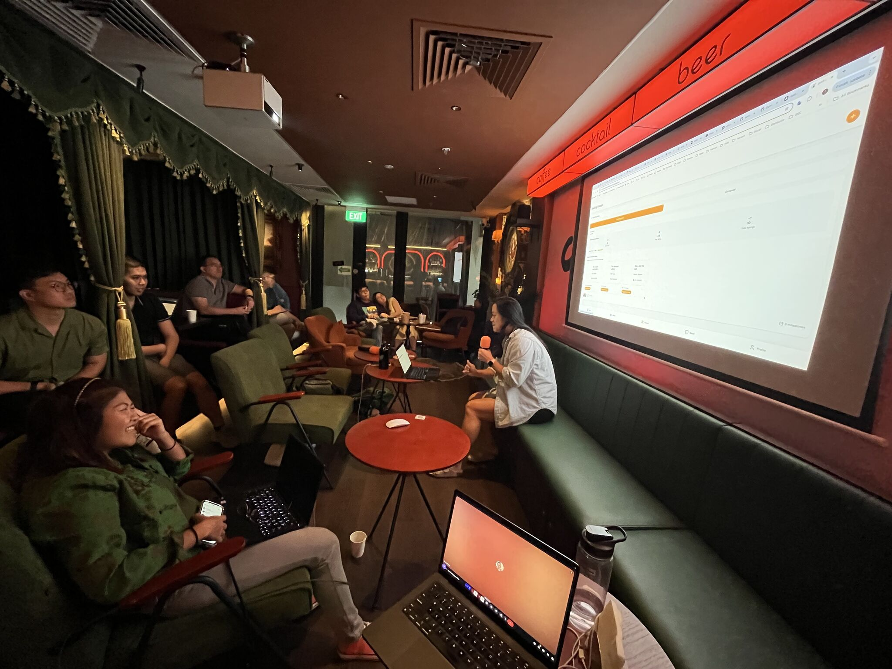
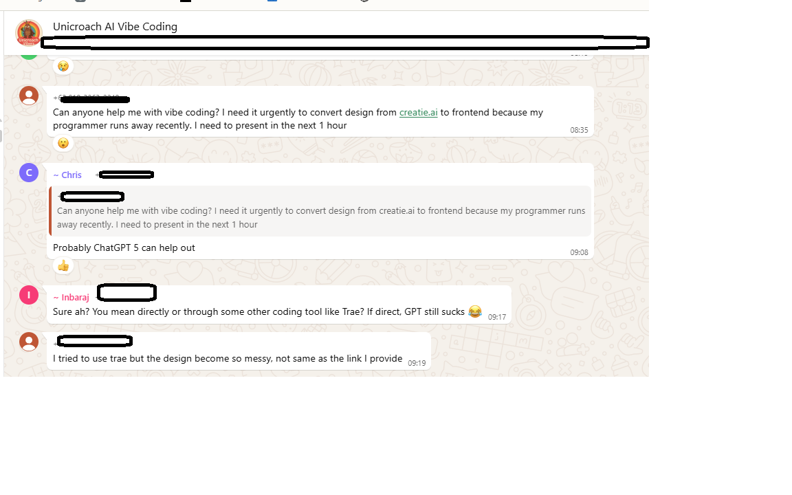

# What is Vibe Coding

> There's a new kind of coding I call "vibe coding", where you fully give in to the vibes, embrace exponentials, and **forget that the code even exists**. It's possible because the LLMs (e.g. Cursor Composer w Sonnet) are getting too good. Also I just talk to Composer with SuperWhisper so I barely even touch the keyboard. I ask for the dumbest things like "decrease the padding on the sidebar by half" because I'm too lazy to find it. I "Accept All" always, I don't read the diffs anymore. When I get error messages I just copy paste them in with no comment, usually that fixes it. The code grows beyond my usual comprehension, I'd have to really read through it for a while. Sometimes the LLMs can't fix a bug so I just work around it or ask for random changes until it goes away. **It's not too bad for throwaway weekend projects, but still quite amusing**. I'm building a project or webapp, but it's not really coding - I just see stuff, say stuff, run stuff, and copy paste stuff, and **it mostly works**.



## **Characteristics of Vibe Coding:**

* I "Accept All" always, I don't read the diffs anymore. When I get error messages I just copy paste them in with no comment, usually that fixes it. The code grows beyond my usual comprehension [Not all AI-assisted programming is vibe coding (but vibe coding rocks)](https://simonwillison.net/2025/Mar/19/vibe-coding/)
* Vibe coding simply pulls forward that entry point, bringing it closer to everyday knowledge and thus more accessible to everyone [Is Vibe Coding Bad? What Developers Need to Know](https://www.codecademy.com/resources/blog/what-is-vibe-coding-is-it-bad)
* Fast, fluid, and exploratory. You're reasoning abstractly about what might work and letting AI tools help play out that line of thinking in code. It's improvisational. It's playful [Vibe Coding vs. Spec-Driven Development – Alt + E S V](https://redmonk.com/rstephens/2025/07/31/spec-vs-vibes/)

### **The Good:**

* One of the biggest barriers to that profession is the[ **incredibly steep initial learning curv**<mark style="color:$primary;">**e**</mark>](#user-content-fn-1)[^1]—vibe coding shaves that initial barrier down to almost flat [Not all AI-assisted programming is vibe coding (but vibe coding rocks)](https://simonwillison.net/2025/Mar/19/vibe-coding/)
* Great for prototyping and exploration
* Democratizes coding for non-technical people

(I ran 2 hands-on vibe coding for non-tech people in Singapore and most of them could walk home with an app after a couple of hours)

<figure><figcaption></figcaption></figure>

### **The Problems:**

#### The "Zero Understanding" Trap

**A "vibe coder" announced his SaaS was under attack**. His business, built entirely with AI assistance and "zero hand-written code," was experiencing bypassed subscriptions, maxed-out API keys, and database corruption [Vibe Coding is a Dangerous Fantasy | N’s Blog](https://nmn.gl/blog/vibe-coding-fantasy)

<figure><figcaption></figcaption></figure>

#### **Security Blindness**

If your app deals with user data, payments, or sensitive info, you CANNOT afford AI's sloppy coding. AI doesn't follow best security practices. You're at risk for SQL injection, XSS attacks, and data leaks.

#### **The "It Kinda Works" Syndrome**

You paste AI-generated code, it kinda works, and you move on. But here's the kicker: **Nobody — including you — knows what the code actually does**&#x20;

#### **Scale Breakdown**

At scale, debugging is not just inefficient, it's practically impossible. Debugging is a vital part of programming, and vibe coding is bad at it.

<figure><figcaption></figcaption></figure>

### **When is it OK to vibe code?**&#x20;

> <mark style="background-color:$primary;">**Projects should be low stakes**</mark>. Think about how much harm the code you are writing could cause if it has bugs or security vulnerabilities. Could somebody be harmed—damaged reputation, lost money or something worse? This is particularly important if you plan to build software that will be used by other people!

[https://simonwillison.net/2025/Mar/19/vibe-coding/](https://simonwillison.net/2025/Mar/19/vibe-coding/)

### Conclusion

Think of vibe coding like this analogy: **It's like hiring a junior developer who's incredibly fast but needs constant supervision** [Is Vibe Coding Bad? What Developers Need to Know](https://www.codecademy.com/resources/blog/what-is-vibe-coding-is-it-bad). The key is knowing when to trust, when to verify, and when to step in.

[^1]: 
